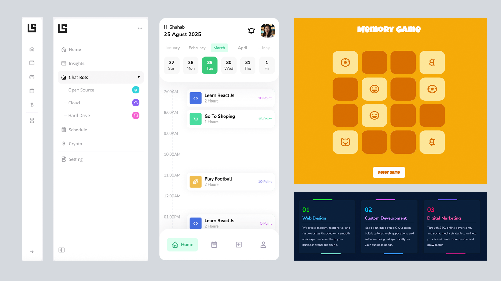

# Video Coding Projects

Welcome to the collection of coding projects featured in my YouTube videos!  
Here, you'll find step-by-step examples of responsive web components built with **HTML, CSS, and JavaScript**.

## 📸 Preview

## What You'll Find Here
- Complete source code for each project
- Instructions and tips to follow along
- Organized by video tutorial for easy reference

## How to Use
1. Browse the folders to find the project you're interested in.
2. Open the HTML files in your browser or editor.
3. Follow along with the YouTube video if you like.

## Contributing
If you want to contribute or suggest improvements, feel free to open an issue or submit a pull request. All contributions are welcome!

## Playlist
Check out the full playlist of tutorials here: [[YouTube Playlist]](https://youtube.com/playlist?list=PL50lkdW5679gsFTvzcah7YEDt3TUJZdNq&si=8MvfMF91khDlKJFe)

---

Happy coding! 🚀
